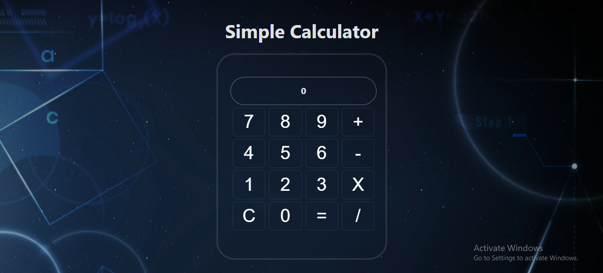

# ⚛️ React Calculator App 🧮

This is a simple yet functional **ReactJS Calculator Application** built with:

✅ Addition ➕  
✅ Subtraction ➖  
✅ Multiplication ✖️  
✅ Division ➗  
✅ Error Handling for invalid operations like `++`, `**`, `//`, `+-`, etc. 🚫  

---

## ✨ Features

✔️ Perform basic arithmetic operations ( ➕ ➖ ✖️ ➗ )  
✔️ Real-time result display using React State ⚛️  
✔️ Error message for invalid expressions ⚠️  
✔️ Clean and modern UI 🎨  

---

## ⚡ Error Handling

The calculator prevents invalid expressions such as:

- `5++3`  
- `4**2`  
- `6//3`  
- `9+-2`  

It will show an **Error Message** 🚫 and block incorrect inputs.  

---

## 🖼️ Screenshot



---

## 🛠️ Technologies Used

- ⚛️ **ReactJS**  
- 🎨 **CSS**  
- ✨ **JavaScript (ES6)**  

---

## 🚀 How to Run

1. Make sure you have **Node.js** and **npm** installed  
2. Clone the repository or download the project files  
3. Run the following commands in terminal:

```bash
npm install  
npm start  
